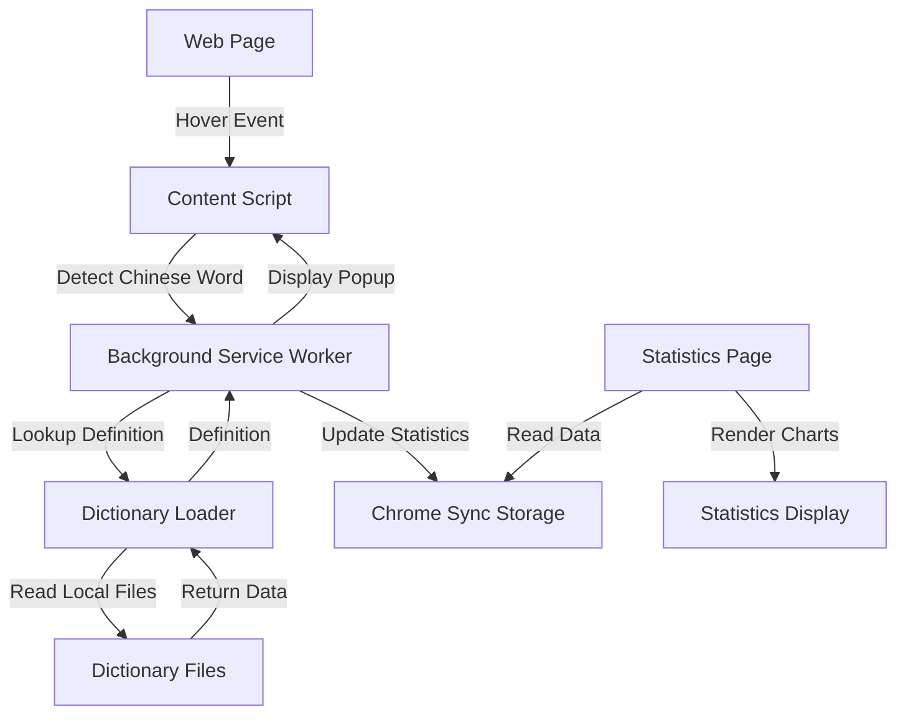

# Architecture Overview

## Project Structure

```
canto-toolbox/
├── manifest.json              # Chrome extension manifest (Manifest V3)
├── background.js              # Service worker for dictionary lookups and statistics
├── content.js                # Content script for hover detection
├── dictionary-loader.js      # Dictionary file loading and searching
├── popup.css                 # Popup styling (injected via content script)
├── stats.html                # Statistics page HTML
├── stats.js                  # Statistics page logic
├── stats.css                 # Statistics page styling
├── icons/                    # Extension icons
│   ├── icon16.png
│   ├── icon48.png
│   └── icon128.png
├── dictionaries/             # Dictionary submodule (git submodule)
│   └── [cc-cedict-yomitan repository]
└── .agents/                  # AI agent documentation
    ├── git-conventions.md
    └── architecture.md
```

## Architecture Flow



## Components

### Content Script (`content.js`)

- **Purpose**: Detects Chinese characters on web pages and handles hover events
- **Responsibilities**:
  - Inject CSS styles into pages
  - Listen for mouseover events
  - Detect Chinese characters using regex `[\u4e00-\u9fff]+`
  - Extract Chinese words from text
  - Send lookup requests to background script
  - Display popup with definitions

### Background Service Worker (`background.js`)

- **Purpose**: Handles dictionary lookups and statistics tracking
- **Responsibilities**:
  - Receive lookup requests from content script
  - Load and search dictionary files
  - Cache lookup results
  - Track word statistics in Chrome sync storage
  - Provide statistics data to stats page

### Dictionary Loader (`dictionary-loader.js`)

- **Purpose**: Load and search local dictionary files
- **Responsibilities**:
  - Load CC-CEDICT (Mandarin) dictionary files
  - Load CC-CANTO (Cantonese) dictionary files
  - Search dictionaries for word definitions
  - Extract pinyin and jyutping pronunciations
  - Handle multiple dictionary file formats

### Statistics Page (`stats.html`, `stats.js`, `stats.css`)

- **Purpose**: Display word frequency statistics
- **Responsibilities**:
  - Load statistics from Chrome sync storage
  - Display word frequency list
  - Provide clear statistics functionality
  - Show word count and hover counts

## Data Flow

1. **Hover Detection**:
   - User hovers over Chinese text on a webpage
   - Content script detects Chinese characters
   - Word is extracted and sent to background script

2. **Dictionary Lookup**:
   - Background script receives lookup request
   - Dictionary loader searches local dictionary files
   - Definition, pinyin, and jyutping are extracted
   - Result is cached and returned

3. **Display**:
   - Content script receives definition data
   - Popup is created and positioned near cursor
   - Definition is displayed with Mandarin and Cantonese info

4. **Statistics**:
   - Each lookup increments word frequency count
   - Statistics stored in Chrome sync storage
   - Stats page reads and displays frequency data

## Storage

- **Chrome Sync Storage**: Used for word statistics (syncs across devices)
- **Local Cache**: In-memory cache for dictionary lookups (24-hour TTL)
- **Dictionary Files**: Local JSON files loaded from submodule

## Dependencies

- **No external npm packages**: Pure vanilla JavaScript
- **Dictionary Submodule**: `cc-cedict-yomitan` repository for dictionary data
- **Chrome Extension APIs**: 
  - `chrome.storage.sync` - Statistics storage
  - `chrome.runtime` - Message passing
  - `chrome.scripting` - Content script injection

## Extension Permissions

- `storage`: For statistics tracking
- `activeTab`: For content script injection
- `scripting`: For dynamic content script injection
- `host_permissions`: For dictionary file access (if needed)

## Dictionary Sources

- **CC-CEDICT**: Mandarin Chinese-English dictionary with Pinyin
- **CC-CANTO**: Cantonese Chinese-English dictionary with Jyutping

Both dictionaries are included as a git submodule from the `cc-cedict-yomitan` repository.
