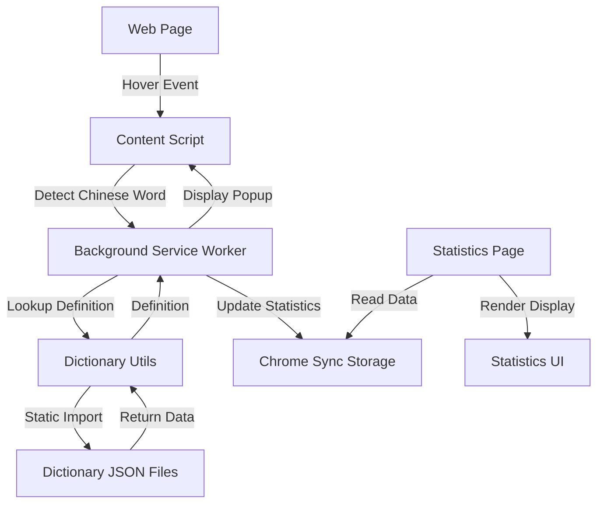

# Architecture Overview

## Project Structure

```
canto-toolbox/
├── manifest.json              # Chrome extension manifest (Manifest V3)
├── vite.config.ts            # Vite build configuration
├── tsconfig.json             # TypeScript configuration
├── src/
│   ├── scripts/
│   │   ├── background.ts     # Service worker for dictionary lookups and statistics
│   │   ├── content.ts        # Content script for hover detection
│   │   └── stats.ts          # Statistics page logic
│   ├── utils/
│   │   ├── dictionary.ts     # Dictionary lookup functions
│   │   ├── dom-element.ts    # DOM element creation utilities
│   │   └── pronunciation-section.ts  # Pronunciation section UI components
│   ├── css/
│   │   ├── popup.css         # Popup styling
│   │   └── stats.css         # Statistics page styling
│   ├── html/
│   │   └── stats.html        # Statistics page HTML
│   ├── data/
│   │   ├── mandarin.json     # Pre-processed Mandarin dictionary
│   │   └── cantonese.json    # Pre-processed Cantonese dictionary
│   ├── types.ts              # TypeScript type definitions
│   └── vite-env.d.ts         # Vite environment type declarations
├── build-tools/              # Build-time dictionary processing
│   ├── processors/           # Dictionary processors
│   └── build-dictionaries.ts # Dictionary build script
├── dictionaries/             # Dictionary submodule (git submodule)
│   ├── mandarin/             # CC-CEDICT source data
│   └── cantonese/            # CC-CANTO source data
├── icons/                    # Extension icons
│   ├── icon16.png
│   ├── icon48.png
│   └── icon128.png
└── .agents/                  # AI agent documentation
    ├── git-conventions.md
    └── architecture.md
```

## Architecture Flow



## Components

### Content Script (`content.ts`)

- **Purpose**: Detects Chinese characters on web pages and handles hover events
- **Key Class**: `ChineseHoverPopupManager` - Encapsulates popup display and selection logic
- **Responsibilities**:
  - Inject CSS styles into pages
  - Listen for mouseover events
  - Detect Chinese characters using regex `[\u4e00-\u9fff]+`
  - Extract Chinese words from text
  - Send lookup requests to background script via `MessageManager`
  - Display popup with definitions using shared UI utilities

### Background Service Worker (`background.ts`)

- **Purpose**: Handles dictionary lookups and statistics tracking
- **Key Class**: `MessageManager` - Provides typed message passing interface
- **Responsibilities**:
  - Receive lookup requests from content script
  - Search statically imported dictionary data (synchronous lookups)
  - Track word statistics in Chrome sync storage
  - Provide statistics data to stats page
  - Handle longest matching word algorithm for multi-character lookups

### Dictionary Utils (`utils/dictionary.ts`)

- **Purpose**: Search statically imported dictionary data
- **Responsibilities**:
  - Statically import pre-processed Mandarin and Cantonese dictionary JSON files
  - Search dictionaries for word definitions (synchronous, O(1) lookups)
  - Filter out Cantonese markers from Mandarin entries
  - Return structured definition results with entries grouped by pronunciation

### Statistics Page (`stats.html`, `stats.ts`, `stats.css`)

- **Purpose**: Display word frequency statistics
- **Key Class**: `StatsManager` - Encapsulates statistics page logic and UI interactions
- **Responsibilities**:
  - Load statistics from Chrome sync storage via `MessageManager`
  - Display word frequency list with expandable definitions
  - Provide clear statistics functionality
  - Show word count and hover counts
  - Lazy-load word definitions when expanded

## Data Flow

1. **Hover Detection**:
   - User hovers over Chinese text on a webpage
   - Content script detects Chinese characters
   - Word is extracted and sent to background script

2. **Dictionary Lookup**:
   - Background script receives lookup request
   - Dictionary utils searches statically imported dictionary data
   - Definition, pinyin, and jyutping are extracted
   - Result is returned synchronously (no caching needed)

3. **Display**:
   - Content script receives definition data
   - Popup is created and positioned near cursor
   - Definition is displayed with Mandarin and Cantonese info

4. **Statistics**:
   - Each lookup increments word frequency count
   - Statistics stored in Chrome sync storage
   - Stats page reads and displays frequency data

## Storage

- **Chrome Sync Storage**: Used for word statistics (syncs across devices, falls back to local storage)
- **Dictionary Files**: Pre-processed JSON files in `src/data/` (statically imported at build time, bundled with extension)

## Dependencies

- **TypeScript**: Type-safe development with TypeScript
- **Vite**: Build tool for bundling and development
- **Chrome Extension APIs**: 
  - `chrome.storage.sync` - Statistics storage (with local fallback)
  - `chrome.runtime` - Message passing
  - `chrome.scripting` - Content script injection
- **Dictionary Submodules**: 
  - `dictionaries/mandarin` - CC-CEDICT source data
  - `dictionaries/cantonese` - CC-CANTO source data
- **Build Tools**: Custom processors for converting raw dictionary data into unified JSON format

## Extension Permissions

- `storage`: For statistics tracking
- `activeTab`: For content script injection
- `scripting`: For dynamic content script injection

## Dictionary Sources

- **CC-CEDICT**: Mandarin Chinese-English dictionary with Pinyin
- **CC-CANTO**: Cantonese Chinese-English dictionary with Jyutping

Both dictionaries are included as git submodules and processed at build time into unified JSON format stored in `src/data/`.

## Key Classes and Utilities

- **`ChineseHoverPopupManager`**: Manages popup display and selection logic in content script
- **`StatsManager`**: Handles statistics page UI and data loading
- **`MessageManager`**: Centralizes typed message passing between content/background scripts
- **`dom-element.ts`**: Shared DOM element creation utilities (`createElement`, `clearElement`)
- **`dictionary.ts`**: Dictionary lookup functions (`lookupWord`, `lookupWordInDictionaries`)
- **`pronunciation-section.ts`**: Pronunciation section UI component creation (`createPronunciationSection`, `groupEntriesByRomanisation`)
