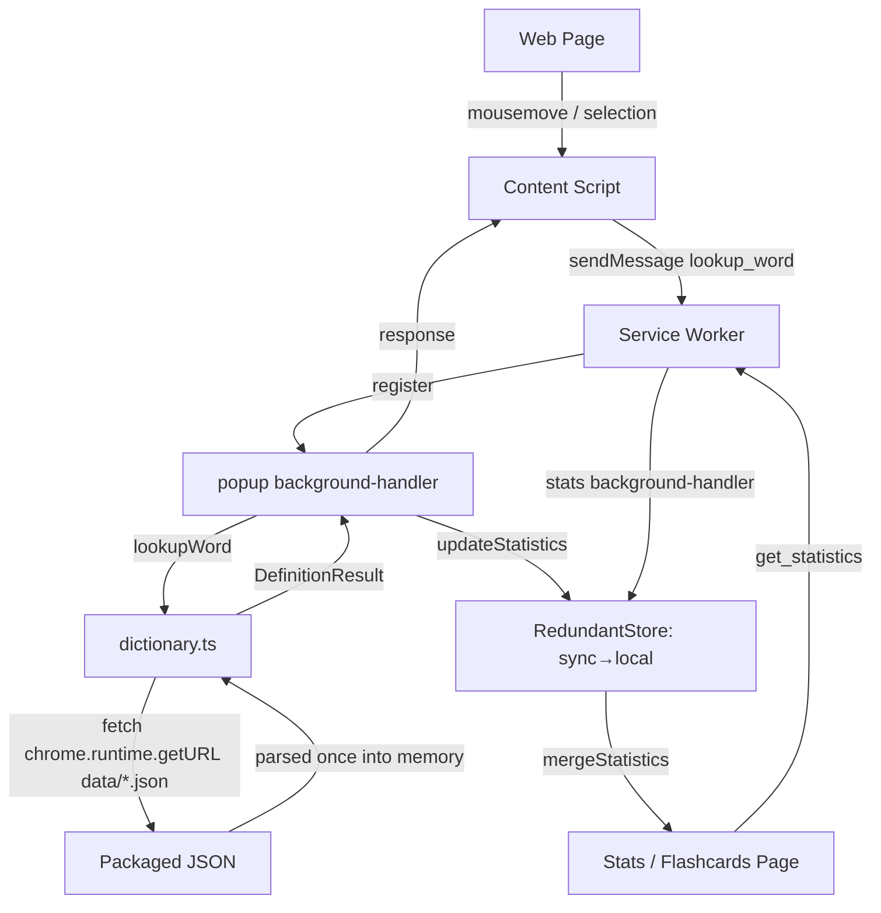

# Architecture Overview

## Project Structure

The source is organised by feature domain, not by file type.

```
canto-toolbox/
├── manifest.json              # Chrome extension manifest (Manifest V3)
├── vite.config.ts             # Vite build configuration
├── vitest.config.ts           # Unit-test (vitest) configuration
├── playwright.config.ts       # E2E (Playwright) configuration
├── tsconfig.json              # TypeScript configuration
├── src/
│   ├── service-worker.ts      # MV3 service-worker entry; registers handlers
│   ├── popup/                 # Hover-popup feature (content script)
│   │   ├── content.ts         # Injected content script; hover/selection detection
│   │   ├── background-handler.ts # lookup_word / track_word message handler
│   │   ├── popup-client.ts    # Typed client wrapper over sendMessage
│   │   ├── popup-storage.ts   # Statistics write path (debounced, bounded)
│   │   └── popup.scss
│   ├── stats/                 # Statistics page
│   │   ├── stats.ts / stats.html / stats.scss
│   │   ├── background-handler.ts # get_statistics handler
│   │   ├── stats-client.ts
│   │   └── stats-storage.ts   # Statistics read path (sync+local merge)
│   ├── flashcards/            # Flashcard review page
│   │   ├── flashcards.ts / flashcards.html / flashcards.scss
│   │   └── flashcard-client.ts
│   ├── dictionary/
│   │   └── dictionary.ts      # Runtime dictionary load + lookup
│   ├── shared/                # Cross-feature utilities and UI components
│   │   ├── message-manager.ts # sendMessage() typed message helper
│   │   ├── storage-manager.ts # Thin chrome.storage wrapper
│   │   ├── redundant-store.ts # sync→local reconciliation policy
│   │   ├── statistics-utils.ts# mergeStatistics()
│   │   ├── bounded-map.ts     # Top-N-by-sort-key map
│   │   ├── debounce.ts        # createBatchedDebounce()
│   │   ├── dom-element.ts     # createElement()
│   │   ├── pronunciation-section.ts # Pronunciation section component
│   │   ├── speech.ts          # Browser TTS, per-reading voice matching
│   │   ├── etymology-section.ts     # Etymology section component
│   │   ├── definition-section.ts    # Shared definition-container component
│   │   ├── styles/            # Shared SCSS partials (tokens, dark mode, …)
│   │   └── types.ts           # TypeScript type definitions
│   └── vite-env.d.ts
├── public/
│   └── data/                  # radicals.json (checked in);
│                              # mandarin/cantonese/etymology.json (generated)
├── build-tools/               # Build-time dictionary processing
│   ├── build-dictionaries.ts  # Dictionary build entry
│   ├── benchmark.ts / check-bundle-size.ts / generate-screenshots.ts
│   └── processors/            # cedict-parser, mandarin/cantonese/etymology, utils
├── dictionaries/              # Source data (git submodules)
│   ├── mandarin/              # CC-CEDICT
│   ├── cantonese/             # CC-Canto
│   └── makemeahanzi/          # Character etymology
├── e2e/                       # Playwright specs
├── icons/
└── .claude/docs/              # Project documentation (this file lives here)
    ├── architecture.md
    ├── dev-workflow.md
    ├── git-conventions.md
    └── testing.md
```

## Architecture Flow



## Components

### Content Script (`src/popup/content.ts`)

- **Purpose**: Detect Chinese text under the cursor / in a selection and show a popup.
- **Key class**: `ChineseHoverPopupManager` — popup display and selection logic.
- **Responsibilities**: inject styles; listen for `mousemove`/`mouseout`/`mouseup`
  (RAF-throttled, cancelled on `destroy()`); detect Chinese with
  `[一-鿿]+`; extract the word at the caret
  (`document.caretRangeFromPoint`); request a lookup via `popup-client`
  (`sendMessage`); render the popup with the shared section components.

### Service Worker (`src/service-worker.ts`)

- **Purpose**: MV3 background entry point. It does not contain handler logic
  itself — it imports each feature's `background-handler.ts` and calls their
  `register()` to attach `chrome.runtime.onMessage` listeners.

### Background Handlers (`*/background-handler.ts`)

- **popup**: handles `lookup_word` (kicks off `initDictionaries()`, looks up the
  word, tracks statistics) and `track_word`.
- **stats**: handles `get_statistics` (reads merged sync+local statistics).
- Message passing is plain functions, not a class. The typed helper is
  `sendMessage()` in `src/shared/message-manager.ts`; each feature has a thin
  `*-client.ts` wrapper around it.

### Dictionary (`src/dictionary/dictionary.ts`)

- **Purpose**: Load and search the dictionaries.
- **Loading**: `initDictionaries()` lazily `fetch`es
  `chrome.runtime.getURL('data/{mandarin,cantonese,etymology}.json')` (the JSON
  is a packaged `web_accessible_resource`, **not** statically imported/bundled)
  and parses it into in-memory maps **once**.
- **Lookup**: after the one-time async load, `lookupWord` is synchronous —
  longest-match over up to `MAX_WORD_LENGTH`, Cantonese-marker filtering, and
  `lookupEtymology` for character breakdown.

### Statistics Page (`src/stats/`)

- **Key class**: `StatsManager`. Loads merged statistics via `stats-client`,
  renders the frequency list with lazily-expanded definitions (rendered by the
  shared `definition-section`), word/hover counts, and a clear action.

### Flashcards Page (`src/flashcards/`)

- Spaced-review over tracked words (count ≥ `MIN_COUNT`, capped at
  `MAX_CARDS`, Fisher-Yates shuffled). "Again" re-queues a card; other ratings
  advance. Definitions render via the shared `definition-section`.

## Data Flow

1. **Hover/selection** — content script extracts the Chinese word and calls
   `sendMessage({ type: 'lookup_word', word })`.
2. **Lookup** — popup `background-handler` awaits `initDictionaries()`, calls
   `lookupWord`, and replies with a `DefinitionResult` (async response channel,
   listener returns `true`).
3. **Display** — content script renders the popup near the cursor.
4. **Statistics** — every lookup/track increments the word count through
   `RedundantStore` (write to sync, fall back to local). The stats/flashcards
   pages read both areas and reconcile with `mergeStatistics`.

## Storage

- **Statistics**: `RedundantStore` over `StorageManager(chrome.storage.sync,
  chrome.storage.local)`. Writes prefer sync and fall back to local; reads
  reconcile both areas via `mergeStatistics`. In-memory write batching uses
  `createBatchedDebounce` and `BoundedMap` (top-N cap).
- **Dictionaries**: generated JSON under `public/data/` (bundled as
  `web_accessible_resources`), fetched at runtime — never written.

## Dependencies

- **TypeScript / Vite** — typed source, bundling (`vite build`, needs
  `--max-old-space-size`).
- **Vitest / Playwright** — unit and e2e tests.
- **Chrome Extension APIs** — `chrome.storage.sync|local` (statistics),
  `chrome.runtime` (message passing, `getURL`).
- **Dictionary submodules** — `dictionaries/mandarin` (CC-CEDICT),
  `dictionaries/cantonese` (CC-Canto), `dictionaries/makemeahanzi` (etymology).
- **build-tools/processors** — convert the raw submodule data into the unified
  JSON written to `public/data/` (deterministic, key-sorted output).

## Extension Permissions

- `storage` — statistics tracking. (This is the only requested permission. The
  content script is declared statically in `manifest.json` with `<all_urls>`;
  there is no `scripting` or `activeTab` permission.)

## Dictionary Sources

- **CC-CEDICT** — Mandarin–English with Pinyin.
- **CC-Canto** — Cantonese–English with Jyutping (including entries with empty
  pinyin brackets, which the parser preserves).
- **makemeahanzi** — character decomposition / etymology.

Processed at build time into unified JSON under `public/data/`.

## Key Classes and Utilities

- **`ChineseHoverPopupManager`** (`src/popup/content.ts`) — popup/selection logic.
- **`StatsManager`** (`src/stats/stats.ts`) — stats page UI and data loading.
- **`sendMessage`** (`src/shared/message-manager.ts`) — typed message-passing
  helper with `chrome.runtime.lastError` / validation handling.
- **`RedundantStore`** (`src/shared/redundant-store.ts`) — sync→local
  read/write reconciliation policy over `StorageManager`.
- **`mergeStatistics`** (`src/shared/statistics-utils.ts`) — sums counts and
  reconciles first/last-seen across storage areas.
- **`BoundedMap`** (`src/shared/bounded-map.ts`) — top-N-by-sort-key map.
- **`createBatchedDebounce`** (`src/shared/debounce.ts`) — accumulates keyed
  counts and flushes a batch.
- **`createElement`** (`src/shared/dom-element.ts`) — DOM creation helper.
- **`dictionary.ts`** — `initDictionaries`, `lookupWord`, `lookupEtymology`.
- **`pronunciation-section.ts` / `etymology-section.ts` /
  `definition-section.ts`** — shared UI components; `definition-section`
  composes the other two and is reused by popup, stats and flashcards. Because
  they are shared, the audio button, tone colours and script variant appear on
  all three surfaces from one implementation.
- **`toSyllables`** (`src/shared/pinyin.ts`) — splits a romanisation into
  tone-tagged syllables so each can be coloured; Pinyin gets tone marks,
  Jyutping keeps its digits.
- **`speech.ts`** — `canSpeak` / `speak` over the browser's speech synthesis.
  Voice matching is strict per reading: Cantonese never falls back to a
  Mandarin voice, since the wrong pronunciation is worse than none.
