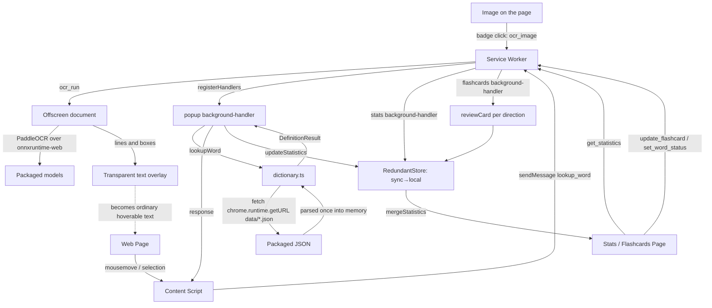

# Architecture Overview

## Project Structure

The source is organised by feature domain, not by file type.

```
canto-toolbox/
├── manifest.json              # Chrome extension manifest (Manifest V3)
├── vite.config.ts             # Vite build configuration
├── vitest.config.ts           # Unit-test (vitest) configuration
├── playwright.config.ts       # E2E (Playwright) configuration
├── eslint.config.js           # Flat ESLint config (typescript-eslint)
├── tsconfig.json              # TypeScript configuration
├── flake.nix                  # Nix dev shell (Node 24 + pnpm)
├── .husky/                    # pre-commit (lint/typecheck/test), commit-msg
├── src/
│   ├── service-worker.ts      # MV3 service-worker entry; registers handlers
│   ├── popup/                 # Hover-popup feature (content script)
│   │   ├── content.ts         # Injected content script; hover/selection detection
│   │   ├── background-handler.ts # lookup_word / track_word message handler
│   │   ├── popup-client.ts    # Typed client wrapper over sendMessage
│   │   ├── popup-storage.ts   # Statistics write path (debounced, bounded)
│   │   └── popup.scss
│   ├── stats/                 # Statistics page
│   │   ├── stats.ts / stats.html / stats.scss
│   │   ├── stats-view.ts      # DOM rendering; element ids live here
│   │   ├── background-handler.ts # get_statistics handler
│   │   ├── stats-client.ts
│   │   ├── overview.ts        # Due/accuracy summary over the whole record
│   │   ├── ordering.ts        # List sorting and frequency-band filtering
│   │   └── stats-storage.ts   # Statistics read path (sync+local merge)
│   ├── flashcards/            # Flashcard review page
│   │   ├── flashcards.ts / flashcards.html / flashcards.scss
│   │   ├── flashcards-view.ts # Screens, card faces, element ids
│   │   ├── session.ts         # Card selection across the review directions
│   │   ├── background-handler.ts # update_flashcard / set_word_status
│   │   └── flashcard-client.ts
│   ├── ocr/                   # Reading Chinese out of images
│   │   ├── image-controller.ts # Image hover, the badge, overlay lifecycle
│   │   ├── overlay.ts         # Recognised box → positioned transparent text
│   │   ├── engine.ts          # PaddleOCR over onnxruntime-web, models on disk
│   │   ├── offscreen.html / offscreen.ts # Engine host; its cache and queue
│   │   ├── background-handler.ts # ocr_image; owns the offscreen document
│   │   ├── ocr-client.ts
│   │   └── ocr.scss
│   ├── dictionary/
│   │   └── dictionary.ts      # Runtime dictionary load + lookup
│   ├── shared/                # Cross-feature utilities and UI components
│   │   ├── message-manager.ts # sendMessage() typed message helper
│   │   ├── message-router.ts  # registerHandlers() onMessage routing
│   │   ├── storage-manager.ts # Thin chrome.storage wrapper
│   │   ├── redundant-store.ts # sync→local reconciliation policy
│   │   ├── statistics-store.ts# The shared statistics key, cap and store
│   │   ├── statistics-utils.ts# mergeStatistics(), getFlashcardStage()
│   │   ├── scheduler.ts       # FSRS review scheduling
│   │   ├── bounded-map.ts     # Top-N-by-sort-key map
│   │   ├── debounce.ts        # createBatchedDebounce()
│   │   ├── dom-element.ts     # createElement()
│   │   ├── frequency.ts       # Corpus rank → learner-facing band
│   │   ├── frequency-badge.ts # The band/rank chip on a definition
│   │   ├── decomposition.ts   # Component glyphs of an IDS decomposition
│   │   ├── definition-list.ts # Collapsing sense list
│   │   ├── pronunciation-section.ts # Pronunciation section component
│   │   ├── speech.ts          # Browser TTS, per-reading voice matching
│   │   ├── etymology-section.ts     # Etymology section component
│   │   ├── definition-section.ts    # Shared definition-container component
│   │   ├── context-sentence.ts      # Met-in sentence, plain or cloze-blanked
│   │   ├── gloss.ts           # Short English gloss for a production prompt
│   │   ├── pinyin.ts          # toSyllables() tone-tagged syllable split
│   │   ├── styles/            # Shared SCSS partials (tokens, dark mode, …)
│   │   └── types.ts           # TypeScript type definitions
│   └── vite-env.d.ts
├── public/
│   ├── data/                  # radicals.json (checked in);
│   │                          # mandarin/cantonese/etymology/frequency.json
│   │                          # (generated)
│   └── ocr/                   # PP-OCRv6 tiny + the ONNX runtime (generated)
├── build-tools/               # Build-time dictionary processing
│   ├── build-dictionaries.ts  # Dictionary build entry
│   ├── fetch-ocr-assets.ts    # Vendors the OCR models and ONNX runtime
│   ├── benchmark.ts / generate-screenshots.ts
│   └── processors/            # cedict-parser, mandarin/cantonese/etymology,
│                              # frequency, utils (+ __tests__/)
├── dictionaries/              # Source data (submodules)
│   ├── mandarin/              # CC-CEDICT
│   ├── cantonese/             # CC-Canto
│   └── makemeahanzi/          # Character etymology
├── e2e/                       # Playwright specs
├── icons/
└── .claude/
    ├── agents/                # dict-inspector, doc-reviewer, domain-reviewer
    └── docs/                  # Project documentation (this file lives here)
        ├── architecture.md
        ├── dev-workflow.md
        ├── git-conventions.md
        └── testing.md
```

## Architecture Flow



## Components

### Content Script (`src/popup/content.ts`)

- **Purpose**: Detect Chinese text under the cursor / in a selection and show a popup.
- **Key class**: `ChineseHoverPopupManager` — popup display and selection logic.
- **Responsibilities**: inject styles; listen for `mousemove`/`mouseout`/`mouseup`
  (throttled on the animation frame alone, cancelled on `destroy()`); detect
  Chinese with `[一-鿿]+`; take the whole run at the caret
  (`document.caretRangeFromPoint`, with a realm-safe `nodeType` check so
  frames work) and send it with the hovered offset, leaving segmentation to
  the dictionary; request a lookup via `popup-client` (`sendMessage`); render
  the popup with the shared section components.
- **Study signal**: showing a popup is not studying. After `DWELL_MS` with the
  popup still on the same word, the script sends `track_word` — once per word,
  along with `extractContext`'s snippet of the sentence it was met in. The
  popup's **+ Study** button sends the same message at once, with `pin` set.

### Service Worker (`src/service-worker.ts`)

- **Purpose**: MV3 background entry point. It does not contain handler logic
  itself — it imports each feature's `background-handler.ts` and calls their
  `register()` to attach `chrome.runtime.onMessage` listeners.

### Background Handlers (`*/background-handler.ts`)

- Each handler registers through `registerHandlers()`
  (`src/shared/message-router.ts`), which owns the parts every listener would
  otherwise repeat: the async response channel (`return true`), passing an
  unrecognised message through (`return false`) so another feature's listener
  can answer it, and turning a thrown error into an `ErrorResponse`.
- **popup**: handles `lookup_word` (kicks off `initDictionaries()`, then
  `lookupWordAt` when the message carries a hovered segment, else `lookupWord`)
  and `track_word` (the only path that writes new statistics). A tracked word
  also records what the dictionary knows about it — its corpus rank, and whether
  it is a single character with named parts — since the pages that build
  sessions cannot look either up.
- **stats**: handles `get_statistics` (reads merged sync+local statistics).
- **flashcards**: handles `update_flashcard` (advances one direction's FSRS
  state, and buries a word once its lapses reach `LEECH_LAPSES`) and
  `set_word_status` (retire or pin a word, keeping its progress).
- Message passing is plain functions, not a class. The typed send helper is
  `sendMessage()` in `src/shared/message-manager.ts`; each feature has a thin
  `*-client.ts` wrapper around it.

### Dictionary (`src/dictionary/dictionary.ts`)

- **Purpose**: Load and search the dictionaries.
- **Loading**: `initDictionaries()` lazily `fetch`es
  `chrome.runtime.getURL('data/{mandarin,cantonese,etymology,frequency}.json')`
  (the JSON is a packaged `web_accessible_resource`, **not** statically
  imported/bundled) and parses it into in-memory maps **once**.
- **Lookup**: after the one-time async load, `lookupWord` is synchronous —
  longest-match over up to `MAX_WORD_LENGTH`, Cantonese-marker filtering, and
  `lookupEtymology` for character breakdown.
- **Enrichment**: the longest-match scan tries a candidate per length and start
  offset and throws away all but one, so the parts not needed to judge a
  candidate — the character breakdown and the corpus rank — are added by
  `enrich` to the winner alone. `lookupEtymology` memoises into a capped cache,
  since the same characters recur as the cursor moves.

### Image OCR (`src/ocr/`)

- **Purpose**: make Chinese baked into an image readable by everything that
  already reads Chinese on the page. It is a text *source*, not a second
  lookup path: `overlay.ts` turns recognised boxes into transparent,
  positioned text nodes, and from there the content script's own
  `caretRangeFromPoint` handling finds them exactly as it finds text the page
  wrote itself. `ChineseHoverPopupManager`, `dictionary/`, `stats/` and
  `flashcards/` do not know images exist; the one wire between the two is
  `content.ts` starting `imageOcrManager` alongside `popupManager`, since both
  run in the content script and one entry point has to bootstrap the other.
- **Trigger**: `image-controller.ts` shows a badge on hovering an image at
  least `MIN_IMAGE_SIDE_PX` on both sides; clicking it reads that image. The
  model loads on the first click, never on page load.
- **Where it runs**: an offscreen document (`offscreen.html`). The service
  worker has no DOM and is torn down on idle, which would discard the loaded
  weights between one image and the next; `background-handler.ts` starts the
  document and forwards. `offscreen.ts` serialises requests behind one queue —
  a single inference session cannot usefully be contended for — and caches
  results by image URL in a `BoundedMap`.
- **Engine**: `engine.ts` runs PP-OCRv6 tiny through `ppu-paddle-ocr/web` over
  `onnxruntime-web`. Models and the runtime are fetched from
  `chrome.runtime.getURL('ocr/…')`, so no network access is involved. It must
  *overwrite* `ort.env.wasm.wasmPaths` rather than fill it in, since the
  library points it at a CDN from its own module body.
- **Placement**: `overlay.ts` puts the *i*th character in the *i*th slot of its
  box rather than reproducing the image's typography — that is what the caret
  needs. For Chinese it is exact, since every glyph is full width. Overlays
  live in the body and are positioned in page coordinates, so an ancestor's
  `overflow` or stacking context cannot clip them, and they are re-laid from
  the held result when a responsive page redraws the image at a new size.
- The badge carries no text. A label legible enough to mean "read this" would
  have to be Chinese, and Chinese on the page is something the popup looks up.

### Statistics Page (`src/stats/`)

- **Key class**: `StatsManager` (`stats.ts`) — data loading and event wiring.
  All DOM construction lives in `stats-view.ts`, which also owns the element
  ids the page's HTML and its tests share.
- Renders the frequency list with lazily-expanded definitions (rendered by the
  shared `definition-section`), the sentence each word was met in, study
  counts, and a clear action.
- Above the list, `overview.ts` summarises the whole record — cards due now,
  due today, review accuracy and retired count — deliberately unaffected by the
  list's own filters. `ordering.ts` supplies the frequency-band filter and the
  sort (most studied, most common, due soonest, recently seen).
- Each row can retire a word or pin it for study, through `set_word_status`.

### Flashcards Page (`src/flashcards/`)

- Spaced review driven by `src/shared/scheduler.ts` (FSRS). Each word carries a
  schedule per **review direction**: `recognition` (word → meaning, stored under
  the original `flashcard` key), `production` (meaning + cloze sentence → word)
  and `components` (character → its parts). Production unlocks once recognition
  leaves its learning steps; components additionally needs `decomposable`,
  recorded at track time because this page has no dictionary.
- `flashcards.ts` runs the session; `flashcards-view.ts` renders the screens and
  card faces and owns the element ids.
- `selectSession` (`session.ts`) takes the cards the scheduler says are due,
  most overdue first, then tops the session up with cards not yet introduced —
  ordered by corpus rank, so the commonest word met is taught first — capped at
  `MAX_NEW_CARDS` within `MAX_CARDS`. A word offers **at most one card per
  session**, and retired words are skipped. With nothing due, the empty screen
  reports when the next review lands.
- "Again" re-queues a card within the session, but the scheduler hears each card
  **once per session**: a requeued answer or a "Review Again" round is a drill,
  and rating it again would have FSRS recompute stability over an interval of
  roughly zero. "I know this" (or `K`) retires the word outright.
- Definitions render via the shared `definition-section`; only the production
  front needs a lookup before the question can be posed.

## Data Flow

0. **Image text (optional)** — clicking an image's badge sends `ocr_image`;
   the offscreen document reads it and replies with lines and boxes, which the
   content script lays over the image as transparent text. Every step below
   then applies to it unchanged.
1. **Hover/selection** — content script extracts the Chinese word and calls
   `sendMessage({ type: 'lookup_word', word })`.
2. **Lookup** — popup `background-handler` awaits `initDictionaries()`, calls
   `lookupWord`, and replies with a `DefinitionResult` (the async response
   channel is handled by `registerHandlers`).
3. **Display** — content script renders the popup near the cursor.
4. **Statistics** — a `track_word` (sent after the reader dwells on a word, or
   at once when they press Study in the popup) increments its count through
   `RedundantStore` (write to sync, fall back to local) and records the sentence
   it was first met in, its corpus rank and whether it can carry a components
   card. The stats/flashcards pages read both areas and reconcile with
   `mergeStatistics`, which preserves every field a word carries rather than
   the handful the merge names.

## Storage

- **Statistics**: one storage item, `STATISTICS_KEY`, held in a `RedundantStore`
  over `StorageManager(chrome.storage.sync, chrome.storage.local)`. The key, the
  store and the `MAX_TRACKED_WORDS` cap live in `src/shared/statistics-store.ts`
  so the write path, the stats page's warning and the flashcard handler all
  address the same record. Writes prefer sync and fall back to local; reads
  reconcile both areas via `mergeStatistics`.
- **Write batching**: `popup-storage.ts` accumulates counts with
  `createBatchedDebounce` and writes them through a `BoundedMap` capped at
  `MAX_TRACKED_WORDS`. Eviction is tiered rather than by study count alone —
  reviewed words (tie-broken by last review) outrank pinned, which outrank
  retired, which outrank the merely-seen — so pruning cannot throw away FSRS
  history.
- **Dictionaries**: generated JSON under `public/data/` (bundled as
  `web_accessible_resources`), fetched at runtime — never written.
- **OCR assets**: the models and ONNX runtime under `public/ocr/`, fetched at
  runtime by the offscreen document. Not `web_accessible_resources`: an
  extension page reaches its own `chrome-extension://` files without them.

## Dependencies

- **TypeScript / Vite** — typed source, bundling (`vite build`, needs
  `--max-old-space-size`). `@crxjs/vite-plugin` drives the build from
  `manifest.json`.
- **Vitest / Playwright** — unit and e2e tests.
- **ESLint / husky** — `eslint.config.js` (flat config, typescript-eslint); the
  `pre-commit` hook runs lint, typecheck and tests, and `commit-msg` enforces
  the commit format.
- **ts-fsrs** — the FSRS review scheduler; the four ratings the review UI
  offers are its grade scale exactly.
- **ppu-paddle-ocr / onnxruntime-web** — the image OCR engine. `vite.config.ts`
  aliases `onnxruntime-web` to its extern-wasm entry, which both keeps Rollup
  from emitting the 14 MB and 28 MB binaries alongside the copy already
  vendored, and collapses the library and `engine.ts` onto one ORT instance so
  `ort.env` settings apply to the instance that reads them.
- **Chrome Extension APIs** — `chrome.storage.sync|local` (statistics),
  `chrome.runtime` (message passing, `getURL`, `getContexts`),
  `chrome.offscreen` (the OCR engine's host document).
- **Dictionary submodules** — `dictionaries/mandarin` (CC-CEDICT),
  `dictionaries/cantonese` (CC-Canto), `dictionaries/makemeahanzi` (etymology).
- **build-tools/processors** — convert the raw submodule data into the unified
  JSON written to `public/data/` (deterministic, key-sorted output).
- **chinese-lexicon** (dev only) — carries the SUBTLEX-CH word-frequency data
  the frequency processor reads. Unlike the dictionaries it is an npm
  devDependency rather than a submodule, since only the build reads it and
  nothing of the package ships; the emitted `frequency.json` is ~290 KB.

## Extension Permissions

- `storage` — statistics tracking.
- `offscreen` — the document that hosts the OCR engine.
- `host_permissions: ["<all_urls>"]` — lets the offscreen document fetch an
  image's bytes. Reading them in the content script instead is not an option:
  a cross-origin image taints a canvas. This adds no install warning the
  extension did not already carry, since the content script is declared
  statically with `<all_urls>` and asks for the same access.
- The content script is declared statically in `manifest.json`; there is no
  `scripting` or `activeTab` permission.
- `content_security_policy.extension_pages` allows `'wasm-unsafe-eval'`, which
  an extension page needs to instantiate the OCR runtime's WebAssembly.

## Dictionary Sources

- **CC-CEDICT** — Mandarin–English with Pinyin.
- **CC-Canto** — Cantonese–English with Jyutping (including entries with empty
  pinyin brackets, which the parser preserves).
- **makemeahanzi** — character decomposition / etymology.
- **SUBTLEX-CH** — word frequency from film subtitles (Cai & Brysbaert, 2010),
  read from the `chinese-lexicon` devDependency. Capped at the 20,000
  commonest words: past that, the difference between two ranks is "both rare".
  The package also exposes an HSK helper, but it *estimates* a level from
  character difficulty for words off the official list, so it is not used.

Processed at build time into unified JSON under `public/data/`. Each generated
dictionary is keyed by **both** the simplified and the traditional form, so a
lookup finds a word whichever script the page is written in.

## OCR Model

- **PP-OCRv6 tiny** — one unified detection/recognition pair covering
  Simplified and Traditional Chinese, ~6.4 MB, vendored by
  `build-tools/fetch-ocr-assets.ts` with pinned SHA-256 digests. Its 6,174
  character dictionary reads every one of the 5,000 commonest SUBTLEX-CH words
  and 99.86% of the 20,000 the frequency data is capped at; the next tier up
  costs 25 MB to gain only words the extension already bands as rare.
- Tesseract is the obvious alternative and was rejected: it is tuned for
  scanned documents, and this feature targets screenshots, panels and signage.

## Key Classes and Utilities

- **`ChineseHoverPopupManager`** (`src/popup/content.ts`) — popup/selection logic.
- **`StatsManager`** (`src/stats/stats.ts`) — stats page data loading and wiring.
- **`sendMessage`** (`src/shared/message-manager.ts`) — typed message-passing
  helper with `chrome.runtime.lastError` / validation handling.
- **`registerHandlers`** (`src/shared/message-router.ts`) — typed `onMessage`
  routing; owns the async response channel, the pass-through for messages a
  feature does not handle, and error→`ErrorResponse` conversion.
- **`RedundantStore`** (`src/shared/redundant-store.ts`) — sync→local
  read/write reconciliation policy over `StorageManager`.
- **`statisticsStore` / `STATISTICS_KEY` / `MAX_TRACKED_WORDS`**
  (`src/shared/statistics-store.ts`) — the single record every feature addresses.
- **`mergeStatistics`** (`src/shared/statistics-utils.ts`) — sums counts and
  reconciles first/last-seen across storage areas.
- **`getFlashcardStage`** (`src/shared/statistics-utils.ts`) — new / learning /
  familiar / mastered, derived from the scheduler so `mastered` decays.
- **`reviewCard` / `isDue` / `isLeech`** (`src/shared/scheduler.ts`) — FSRS
  scheduling, persisted as the compact `SrsState` on each direction's progress.
- **`progressFor` / `DIRECTION_FIELD` / `schedulesOf`**
  (`src/shared/statistics-utils.ts`) — where each review direction's schedule
  lives on a word, and the shared walk over all three.
- **`selectSession`** (`src/flashcards/session.ts`) — which card each word
  offers a session, and in what order.
- **`BoundedMap`** (`src/shared/bounded-map.ts`) — top-N-by-sort-key map;
  `setAll` inserts a batch and prunes once, so a batch of new words is ranked
  against the record one time rather than after each word in it.
- **`createBatchedDebounce`** (`src/shared/debounce.ts`) — accumulates keyed
  counts and flushes a batch.
- **`createElement`** (`src/shared/dom-element.ts`) — DOM creation helper.
- **`placeItem` / `placeResult` / `createOverlay`** (`src/ocr/overlay.ts`) — a
  recognised box in the image's own pixels turned into a transparent text node
  the caret can land in, at whatever size the page draws the image.
- **`recognise`** (`src/ocr/engine.ts`) — image URL → text with boxes, over the
  packaged PP-OCRv6 model.
- **`dictionary.ts`** — `initDictionaries`, `lookupWord`, `lookupWordAt`,
  `lookupEtymology`, `lookupFrequency`.
- **`bandForRank` / `BAND_LABELS`** (`src/shared/frequency.ts`) — a corpus rank
  banded into something a learner can act on (Core 1000 → Rare);
  `frequency-badge.ts` draws it on the definition.
- **`parseComponents`** (`src/shared/decomposition.ts`) — the component glyphs
  of a makemeahanzi decomposition, Ideographic Description Characters dropped.
- **`pronunciation-section.ts` / `etymology-section.ts` /
  `definition-section.ts` / `definition-list.ts`** — shared UI components;
  `definition-section` composes the others and is reused by popup, stats and
  flashcards. Because they are shared, the audio button, tone colours, script
  variant and the collapsing sense list appear on all three surfaces from one
  implementation.
- **`toSyllables`** (`src/shared/pinyin.ts`) — splits a romanisation into
  tone-tagged syllables so each can be coloured; Pinyin gets tone marks,
  Jyutping keeps its digits.
- **`speech.ts`** — `canSpeak` / `speak` over the browser's speech synthesis.
  Voice matching is strict per reading: Cantonese never falls back to a
  Mandarin voice, since the wrong pronunciation is worse than none.
