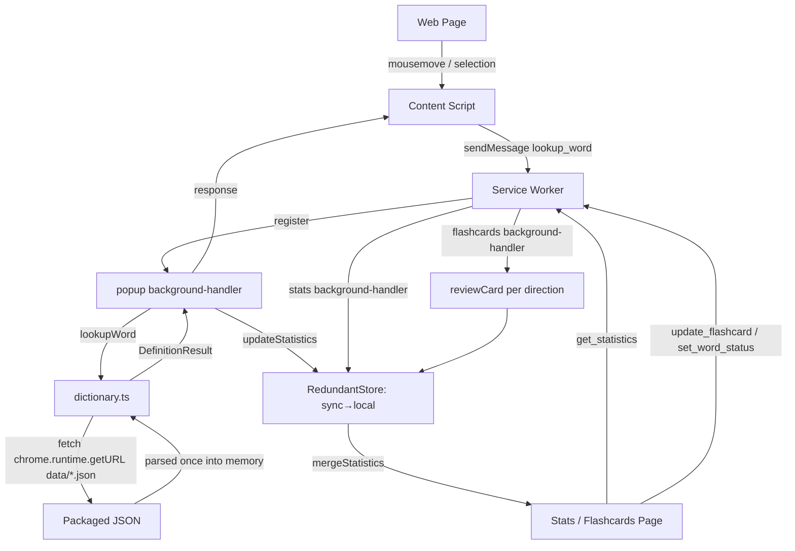

# Architecture Overview

## Project Structure

The source is organised by feature domain, not by file type.

```
canto-toolbox/
├── manifest.json              # Chrome extension manifest (Manifest V3)
├── vite.config.ts             # Vite build configuration
├── vitest.config.ts           # Unit-test (vitest) configuration
├── playwright.config.ts       # E2E (Playwright) configuration
├── tsconfig.json              # TypeScript configuration
├── src/
│   ├── service-worker.ts      # MV3 service-worker entry; registers handlers
│   ├── popup/                 # Hover-popup feature (content script)
│   │   ├── content.ts         # Injected content script; hover/selection detection
│   │   ├── background-handler.ts # lookup_word / track_word message handler
│   │   ├── popup-client.ts    # Typed client wrapper over sendMessage
│   │   ├── popup-storage.ts   # Statistics write path (debounced, bounded)
│   │   └── popup.scss
│   ├── stats/                 # Statistics page
│   │   ├── stats.ts / stats.html / stats.scss
│   │   ├── background-handler.ts # get_statistics handler
│   │   ├── stats-client.ts
│   │   ├── overview.ts        # Due/accuracy summary over the whole record
│   │   ├── ordering.ts        # List sorting and frequency-band filtering
│   │   └── stats-storage.ts   # Statistics read path (sync+local merge)
│   ├── flashcards/            # Flashcard review page
│   │   ├── flashcards.ts / flashcards.html / flashcards.scss
│   │   ├── session.ts         # Card selection across the review directions
│   │   ├── background-handler.ts # update_flashcard / set_word_status
│   │   └── flashcard-client.ts
│   ├── dictionary/
│   │   └── dictionary.ts      # Runtime dictionary load + lookup
│   ├── shared/                # Cross-feature utilities and UI components
│   │   ├── message-manager.ts # sendMessage() typed message helper
│   │   ├── storage-manager.ts # Thin chrome.storage wrapper
│   │   ├── redundant-store.ts # sync→local reconciliation policy
│   │   ├── statistics-utils.ts# mergeStatistics(), getFlashcardStage()
│   │   ├── scheduler.ts       # FSRS review scheduling
│   │   ├── bounded-map.ts     # Top-N-by-sort-key map
│   │   ├── debounce.ts        # createBatchedDebounce()
│   │   ├── dom-element.ts     # createElement()
│   │   ├── pronunciation-section.ts # Pronunciation section component
│   │   ├── speech.ts          # Browser TTS, per-reading voice matching
│   │   ├── etymology-section.ts     # Etymology section component
│   │   ├── definition-section.ts    # Shared definition-container component
│   │   ├── context-sentence.ts      # Met-in sentence, plain or cloze-blanked
│   │   ├── gloss.ts           # Short English gloss for a production prompt
│   │   ├── styles/            # Shared SCSS partials (tokens, dark mode, …)
│   │   └── types.ts           # TypeScript type definitions
│   └── vite-env.d.ts
├── public/
│   └── data/                  # radicals.json (checked in);
│                              # mandarin/cantonese/etymology/frequency.json
│                              # (generated)
├── build-tools/               # Build-time dictionary processing
│   ├── build-dictionaries.ts  # Dictionary build entry
│   ├── benchmark.ts / check-bundle-size.ts / generate-screenshots.ts
│   └── processors/            # cedict-parser, mandarin/cantonese/etymology,
│                              # frequency, utils
├── dictionaries/              # Source data (git submodules)
│   ├── mandarin/              # CC-CEDICT
│   ├── cantonese/             # CC-Canto
│   └── makemeahanzi/          # Character etymology
├── e2e/                       # Playwright specs
├── icons/
└── .claude/docs/              # Project documentation (this file lives here)
    ├── architecture.md
    ├── dev-workflow.md
    ├── git-conventions.md
    └── testing.md
```

## Architecture Flow



## Components

### Content Script (`src/popup/content.ts`)

- **Purpose**: Detect Chinese text under the cursor / in a selection and show a popup.
- **Key class**: `ChineseHoverPopupManager` — popup display and selection logic.
- **Responsibilities**: inject styles; listen for `mousemove`/`mouseout`/`mouseup`
  (RAF-throttled, cancelled on `destroy()`); detect Chinese with
  `[一-鿿]+`; take the whole run at the caret
  (`document.caretRangeFromPoint`, with a realm-safe `nodeType` check so
  frames work) and send it with the hovered offset, leaving segmentation to
  the dictionary; request a lookup via `popup-client` (`sendMessage`); render
  the popup with the shared section components.
- **Study signal**: showing a popup is not studying. After `DWELL_MS` with the
  popup still on the same word, the script sends `track_word` — once per word,
  along with `extractContext`'s snippet of the sentence it was met in.

### Service Worker (`src/service-worker.ts`)

- **Purpose**: MV3 background entry point. It does not contain handler logic
  itself — it imports each feature's `background-handler.ts` and calls their
  `register()` to attach `chrome.runtime.onMessage` listeners.

### Background Handlers (`*/background-handler.ts`)

- **popup**: handles `lookup_word` (kicks off `initDictionaries()`, then
  `lookupWordAt` when the message carries a hovered segment, else `lookupWord`)
  and `track_word` (the only path that writes new statistics). A tracked word
  also records what the dictionary knows about it — its corpus rank, and whether
  it is a single character with named parts — since the pages that build
  sessions cannot look either up.
- **stats**: handles `get_statistics` (reads merged sync+local statistics).
- **flashcards**: handles `update_flashcard` (advances one direction's FSRS
  state, and buries a word once its lapses reach `LEECH_LAPSES`) and
  `set_word_status` (retire or pin a word, keeping its progress).
- Message passing is plain functions, not a class. The typed helper is
  `sendMessage()` in `src/shared/message-manager.ts`; each feature has a thin
  `*-client.ts` wrapper around it.

### Dictionary (`src/dictionary/dictionary.ts`)

- **Purpose**: Load and search the dictionaries.
- **Loading**: `initDictionaries()` lazily `fetch`es
  `chrome.runtime.getURL('data/{mandarin,cantonese,etymology,frequency}.json')`
  (the JSON is a packaged `web_accessible_resource`, **not** statically
  imported/bundled) and parses it into in-memory maps **once**.
- **Lookup**: after the one-time async load, `lookupWord` is synchronous —
  longest-match over up to `MAX_WORD_LENGTH`, Cantonese-marker filtering, and
  `lookupEtymology` for character breakdown.

### Statistics Page (`src/stats/`)

- **Key class**: `StatsManager`. Loads merged statistics via `stats-client`,
  renders the frequency list with lazily-expanded definitions (rendered by the
  shared `definition-section`), the sentence each word was met in, study
  counts, and a clear action.
- Above the list, `overview.ts` summarises the whole record — cards due now,
  due today, review accuracy and retired count — deliberately unaffected by the
  list's own filters. `ordering.ts` supplies the frequency-band filter and the
  sort (most studied, commonest, due soonest, recently seen).
- Each row can retire a word or pin it for study, through `set_word_status`.

### Flashcards Page (`src/flashcards/`)

- Spaced review driven by `src/shared/scheduler.ts` (FSRS). Each word carries a
  schedule per **review direction**: `recognition` (word → meaning, stored under
  the original `flashcard` key), `production` (meaning + cloze sentence → word)
  and `components` (character → its parts). Production unlocks once recognition
  leaves its learning steps; components additionally needs `decomposable`,
  recorded at track time because this page has no dictionary.
- `selectSession` (`session.ts`) takes the cards the scheduler says are due,
  most overdue first, then tops the session up with cards not yet introduced —
  ordered by corpus rank, so the commonest word met is taught first — capped at
  `MAX_NEW_CARDS` within `MAX_CARDS`. A word offers **at most one card per
  session**, and retired words are skipped. With nothing due, the empty screen
  reports when the next review lands.
- "Again" re-queues a card within the session, but the scheduler hears each card
  **once per session**: a requeued answer or a "Review Again" round is a drill,
  and rating it again would have FSRS recompute stability over an interval of
  roughly zero. "I know this" (or `K`) retires the word outright.
- Definitions render via the shared `definition-section`; only the production
  front needs a lookup before the question can be posed.

## Data Flow

1. **Hover/selection** — content script extracts the Chinese word and calls
   `sendMessage({ type: 'lookup_word', word })`.
2. **Lookup** — popup `background-handler` awaits `initDictionaries()`, calls
   `lookupWord`, and replies with a `DefinitionResult` (async response channel,
   listener returns `true`).
3. **Display** — content script renders the popup near the cursor.
4. **Statistics** — a `track_word` (sent after the reader dwells on a word, or
   at once when they press Study in the popup) increments its count through
   `RedundantStore` (write to sync, fall back to local) and records the sentence
   it was first met in, its corpus rank and whether it can carry a components
   card. The stats/flashcards pages read both areas and reconcile with
   `mergeStatistics`, which preserves every field a word carries rather than
   the handful the merge names.

## Storage

- **Statistics**: `RedundantStore` over `StorageManager(chrome.storage.sync,
  chrome.storage.local)`. Writes prefer sync and fall back to local; reads
  reconcile both areas via `mergeStatistics`. In-memory write batching uses
  `createBatchedDebounce` and `BoundedMap` (top-N cap).
- **Dictionaries**: generated JSON under `public/data/` (bundled as
  `web_accessible_resources`), fetched at runtime — never written.

## Dependencies

- **TypeScript / Vite** — typed source, bundling (`vite build`, needs
  `--max-old-space-size`).
- **Vitest / Playwright** — unit and e2e tests.
- **ts-fsrs** — the FSRS review scheduler. The only runtime dependency; the
  four ratings the review UI offers are its grade scale exactly.
- **Chrome Extension APIs** — `chrome.storage.sync|local` (statistics),
  `chrome.runtime` (message passing, `getURL`).
- **Dictionary submodules** — `dictionaries/mandarin` (CC-CEDICT),
  `dictionaries/cantonese` (CC-Canto), `dictionaries/makemeahanzi` (etymology).
- **build-tools/processors** — convert the raw submodule data into the unified
  JSON written to `public/data/` (deterministic, key-sorted output).
- **chinese-lexicon** (dev only) — carries the SUBTLEX-CH word-frequency data
  the frequency processor reads. Unlike the dictionaries it is an npm
  devDependency rather than a submodule, since only the build reads it and
  nothing of the package ships; the emitted `frequency.json` is ~290 KB.

## Extension Permissions

- `storage` — statistics tracking. (This is the only requested permission. The
  content script is declared statically in `manifest.json` with `<all_urls>`;
  there is no `scripting` or `activeTab` permission.)

## Dictionary Sources

- **CC-CEDICT** — Mandarin–English with Pinyin.
- **CC-Canto** — Cantonese–English with Jyutping (including entries with empty
  pinyin brackets, which the parser preserves).
- **makemeahanzi** — character decomposition / etymology.
- **SUBTLEX-CH** — word frequency from film subtitles (Cai & Brysbaert, 2010),
  read from the `chinese-lexicon` devDependency. Capped at the 20,000
  commonest words: past that, the difference between two ranks is "both rare".
  The package also exposes an HSK helper, but it *estimates* a level from
  character difficulty for words off the official list, so it is not used.

Processed at build time into unified JSON under `public/data/`.

## Key Classes and Utilities

- **`ChineseHoverPopupManager`** (`src/popup/content.ts`) — popup/selection logic.
- **`StatsManager`** (`src/stats/stats.ts`) — stats page UI and data loading.
- **`sendMessage`** (`src/shared/message-manager.ts`) — typed message-passing
  helper with `chrome.runtime.lastError` / validation handling.
- **`RedundantStore`** (`src/shared/redundant-store.ts`) — sync→local
  read/write reconciliation policy over `StorageManager`.
- **`mergeStatistics`** (`src/shared/statistics-utils.ts`) — sums counts and
  reconciles first/last-seen across storage areas.
- **`getFlashcardStage`** (`src/shared/statistics-utils.ts`) — new / learning /
  familiar / mastered, derived from the scheduler so `mastered` decays.
- **`reviewCard` / `isDue` / `isLeech`** (`src/shared/scheduler.ts`) — FSRS
  scheduling, persisted as the compact `SrsState` on each direction's progress.
- **`progressFor` / `DIRECTION_FIELD`** (`src/shared/statistics-utils.ts`) —
  where each review direction's schedule lives on a word.
- **`selectSession`** (`src/flashcards/session.ts`) — which card each word
  offers a session, and in what order.
- **`BoundedMap`** (`src/shared/bounded-map.ts`) — top-N-by-sort-key map;
  statistics rank reviewed words above unreviewed ones — and against each other
  by last review — so pruning cannot discard review history.
- **`createBatchedDebounce`** (`src/shared/debounce.ts`) — accumulates keyed
  counts and flushes a batch.
- **`createElement`** (`src/shared/dom-element.ts`) — DOM creation helper.
- **`dictionary.ts`** — `initDictionaries`, `lookupWord`, `lookupEtymology`.
- **`pronunciation-section.ts` / `etymology-section.ts` /
  `definition-section.ts`** — shared UI components; `definition-section`
  composes the other two and is reused by popup, stats and flashcards. Because
  they are shared, the audio button, tone colours and script variant appear on
  all three surfaces from one implementation.
- **`toSyllables`** (`src/shared/pinyin.ts`) — splits a romanisation into
  tone-tagged syllables so each can be coloured; Pinyin gets tone marks,
  Jyutping keeps its digits.
- **`speech.ts`** — `canSpeak` / `speak` over the browser's speech synthesis.
  Voice matching is strict per reading: Cantonese never falls back to a
  Mandarin voice, since the wrong pronunciation is worse than none.
