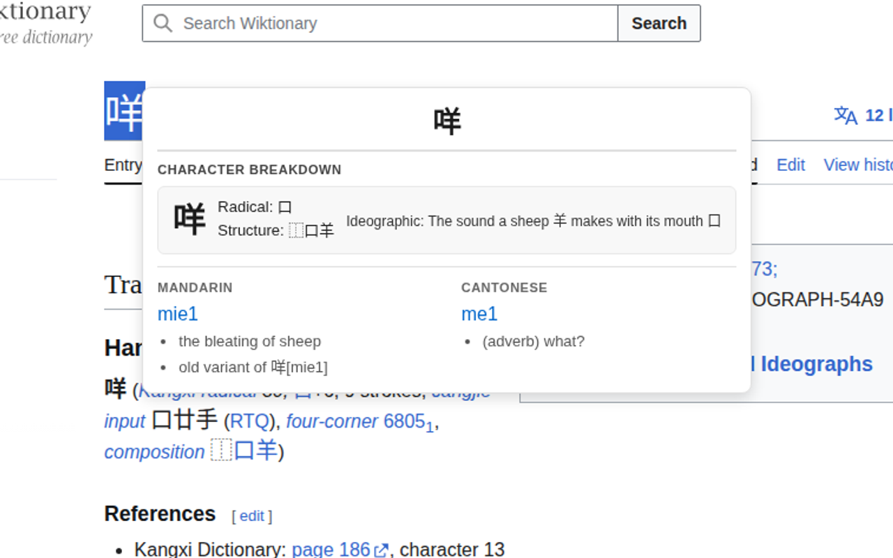
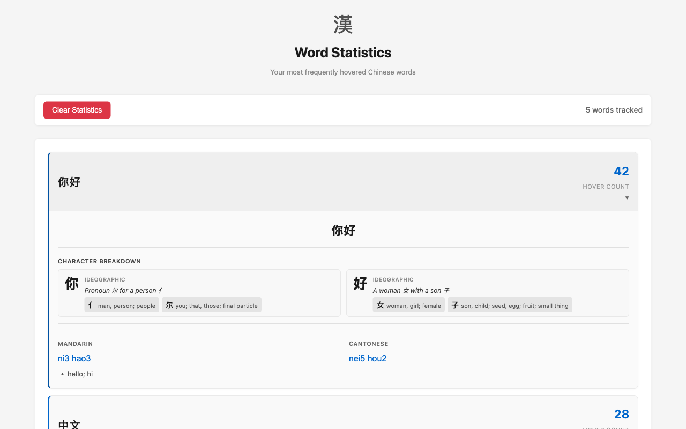
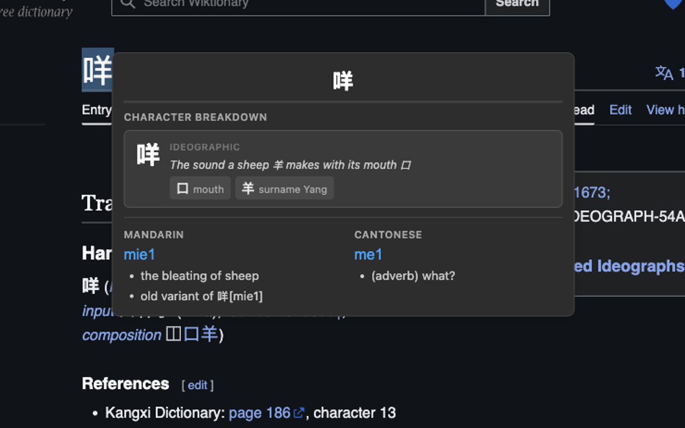

# Canto Toolbox

A Chrome extension that displays Chinese word definitions in both Mandarin and Cantonese when you hover over Chinese characters on any webpage. Perfect for language learners and anyone reading Chinese text online.

> **Note**: This project is an experiment in using [Cursor](https://cursor.com/) as an AI-assisted development environment.

## Features

- **Hover Detection**: Automatically detects Chinese characters as you move your mouse over text
- **Dual Language Support**: Shows definitions in both Mandarin (with Pinyin) and Cantonese (with Jyutping)
- **Works Everywhere**: Functions on any website with Chinese text
- **Word Statistics**: Tracks your most frequently looked-up words
- **Multi-word Selection**: Select multiple characters to look up phrases
- **Dark Mode Support**: Automatically adapts to your system theme
- **Offline Dictionary**: Uses local dictionary files - no API calls required
- **Fast Lookups**: Pre-processed dictionaries for instant results

## Screenshots

### Hover Popup

*Hover over Chinese text to see Mandarin and Cantonese definitions*

### Word Statistics

*Track your most frequently looked-up words*

### Dark Mode

*Automatically adapts to your system theme*

## Building and Installation

### Prerequisites

- **Node.js** >= 18.0.0
- **pnpm** >= 8.0.0
- **Git** (for initializing dictionary submodules)

### Build Steps

1. **Clone the repository** (including submodules):
   ```bash
   git clone --recurse-submodules https://github.com/VWongDev/canto-toolbox.git
   cd canto-toolbox
   ```

   If you've already cloned without submodules:
   ```bash
   git submodule update --init --recursive
   ```

2. **Install dependencies**:
   ```bash
   pnpm install
   ```

3. **Build the extension**:
   ```bash
   pnpm build
   ```

   This command will:
   - Pre-process dictionary files from the submodules
   - Build the extension using Vite
   - Output the extension to the `dist/` directory

4. **Load the extension in Chrome**:
   - Open Chrome and navigate to `chrome://extensions/`
   - Enable "Developer mode" (toggle in the top right)
   - Click "Load unpacked"
   - Select the `dist/` directory from this project

### Development

For development with hot reload, you can use:
```bash
pnpm preview
```

To clean build artifacts:
```bash
pnpm clean
```

## Usage

1. **Hover over Chinese text**: Simply move your mouse over any Chinese characters on a webpage. A popup will appear showing:
   - The word in large text
   - Mandarin pronunciation (Pinyin) and definitions
   - Cantonese pronunciation (Jyutping) and definitions

2. **Select multiple characters**: Click and drag to select multiple Chinese characters to look up phrases or compound words.

3. **View statistics**: Click the extension icon in the Chrome toolbar to see:
   - Your most frequently looked-up words
   - Hover counts for each word
   - Detailed definitions for each tracked word

## Dictionary Resources

This extension uses high-quality, open-source dictionary data:

### CC-CEDICT (Mandarin)
- **Source**: [CC-CEDICT](https://www.mdbg.net/chinese/dictionary?page=cc-cedict)
- **Repository**: [edvardsr/cc-cedict](https://github.com/edvardsr/cc-cedict)
- **License**: MIT License
- **Description**: A comprehensive Chinese-English dictionary with support for both simplified and traditional Chinese characters, including Pinyin pronunciations.

### CC-CANTO (Cantonese)
- **Source**: [CC-Canto](https://cc-canto.org/)
- **Repository**: [amadeusine/cc-canto-data](https://github.com/amadeusine/cc-canto-data)
- **License**: Creative Commons Attribution-ShareAlike 3.0 Unported (CC BY-SA 3.0)
- **Copyright**: CC-Canto and CC-CEDICT Cantonese readings are copyright (c) 2015-16 Pleco Software Incorporated
- **Description**: A comprehensive Cantonese-English dictionary with Jyutping pronunciations.

## Inspiration

The hover detection mechanism in this extension is inspired by [Zhongwen](https://github.com/cschiller/zhongwen), a popular Chinese-English popup dictionary extension. This extension adapts and extends that approach to support both Mandarin and Cantonese dictionaries.

## License

This project is licensed under the MIT License.

## Contributing

Contributions are welcome! Please feel free to submit issues or pull requests.

