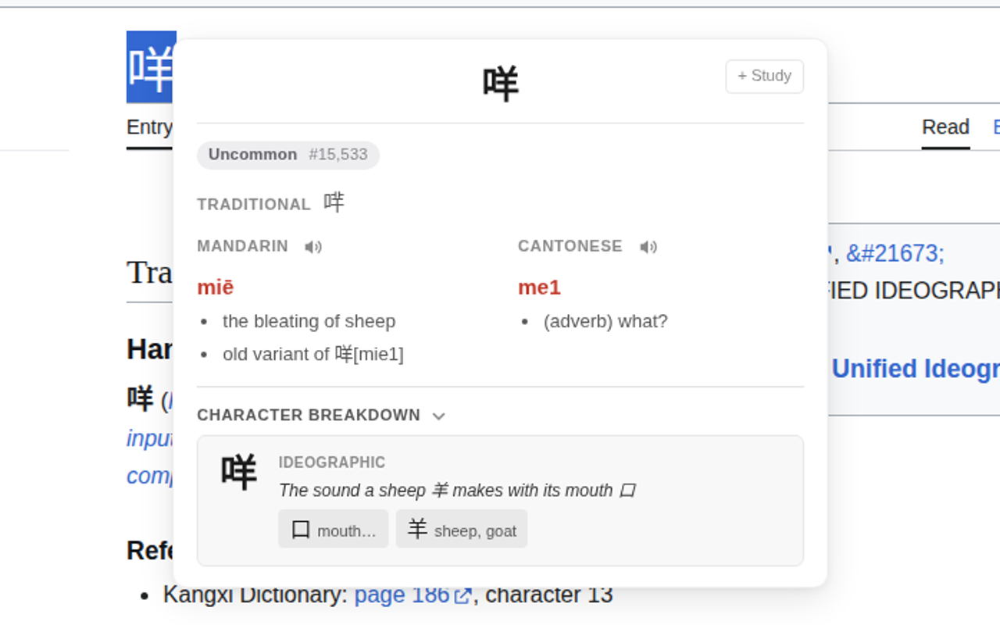
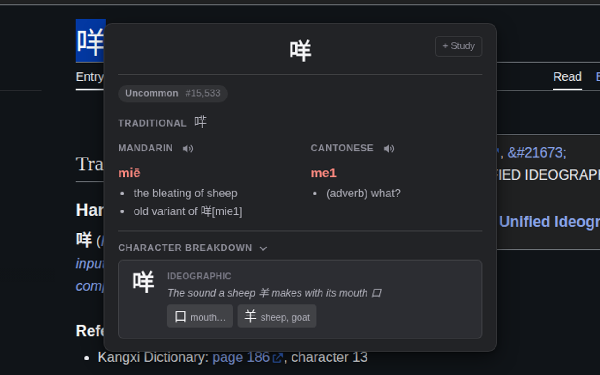

# Canto Toolbox

Read Chinese on the web without leaving the page. Hover any word for Mandarin and Cantonese definitions, then review what you looked up with spaced repetition — so reading doubles as study.

> **Note**: This project is an experiment in using [Claude Code](https://docs.anthropic.com/en/docs/claude-code) as an AI-assisted development environment.

## Features

- **Nothing to type or copy**: hover Chinese anywhere on any site and the word under your cursor comes up instantly
- **Mandarin and Cantonese together**: both readings side by side, tone-coloured, each with a speaker button and its own definitions
- **Reading becomes revision**: words you pause on are saved with the sentence you met them in, then come back as spaced-repetition flashcards
- **Text inside images too**: screenshots, panels, menus and signage — click the badge on an image and its Chinese becomes hoverable like any other text, flashcards and all
- **Instant, offline, private**: the dictionaries and the OCR model ship with the extension — no accounts, no API calls, no lookup ever leaves your browser

## Screenshots

### Hover Popup


*Hover over Chinese text to see Mandarin and Cantonese definitions*

### Word Statistics


*Track your most frequently looked-up words*

### Flashcard Review


*Review your looked-up words with spaced repetition*

### Dark Mode


*Automatically adapts to your system theme*

## Building and Installation

### Prerequisites

- **Node.js** >= 22.0.0 (24 is what the dev shell and CI use)
- **pnpm** >= 8.0.0
- **Git** (for initializing dictionary submodules)

### Build Steps

1. **Clone the repository** (including submodules):
   ```bash
   git clone --recurse-submodules https://github.com/VWongDev/canto-toolbox.git
   cd canto-toolbox
   ```

   If you've already cloned without submodules:
   ```bash
   git submodule update --init --recursive
   ```

2. **Install dependencies**:
   ```bash
   pnpm install
   ```

3. **Build the extension**:
   ```bash
   pnpm build
   ```

   This command will:
   - Pre-process dictionary files from the submodules
   - Download the pinned OCR model and copy in the ONNX runtime (needs network access the first time)
   - Build the extension using Vite
   - Output the extension to the `dist/` directory (about 81 MB)

4. **Load the extension in Chrome**:
   - Open Chrome and navigate to `chrome://extensions/`
   - Enable "Developer mode" (toggle in the top right)
   - Click "Load unpacked"
   - Select the `dist/` directory from this project

### Development

For development with hot reload, you can use:
```bash
pnpm preview
```

To clean build artifacts:
```bash
pnpm clean
```

To regenerate the screenshots used in the README and store listing (builds the extension, then launches Chrome to capture hover-popup, statistics, flashcard-review, and dark-mode screenshots):
```bash
pnpm screenshots
```
Screenshots are written to `screenshots/`. Chrome runs in headed mode because extensions are not supported in headless.

## Usage

1. **Read**: hover Chinese text for a popup with both readings, definitions, frequency, and a per-character breakdown. Drag-select for a phrase. For Chinese inside an image, hover the image and click the badge in its corner — the text it holds becomes hoverable in place.
2. **Track**: pause on a word and it's saved. The extension icon opens your word list with the sentence each one came from.
3. **Review**: open the flashcard page and rate each card Again, Hard, Good or Easy. The [FSRS](https://github.com/open-spaced-repetition/ts-fsrs) scheduler decides when it comes back; when nothing is due, the page says when the next review lands.

## Dictionary Resources

This extension uses high-quality, open-source dictionary data:

### CC-CEDICT (Mandarin)
- **Source**: [CC-CEDICT](https://www.mdbg.net/chinese/dictionary?page=cc-cedict)
- **Repository**: [edvardsr/cc-cedict](https://github.com/edvardsr/cc-cedict)
- **License**: MIT License
- **Description**: A comprehensive Chinese-English dictionary with support for both simplified and traditional Chinese characters, including Pinyin pronunciations.

### CC-CANTO (Cantonese)
- **Source**: [CC-Canto](https://cc-canto.org/)
- **Repository**: [amadeusine/cc-canto-data](https://github.com/amadeusine/cc-canto-data)
- **License**: Creative Commons Attribution-ShareAlike 3.0 Unported (CC BY-SA 3.0)
- **Copyright**: CC-Canto and CC-CEDICT Cantonese readings are copyright (c) 2015-16 Pleco Software Incorporated
- **Description**: A comprehensive Cantonese-English dictionary with Jyutping pronunciations.

### Make Me a Hanzi (Etymology)
- **Source**: [Make Me a Hanzi](https://www.skishore.me/makemeahanzi)
- **Repository**: [skishore/makemeahanzi](https://github.com/skishore/makemeahanzi)
- **License**: See [COPYING](https://github.com/skishore/makemeahanzi/blob/master/COPYING) in the repository
- **Description**: Character etymology data (decomposition, radical, pictographic/pictophonetic hints) used in the extension’s etymology display.

### SUBTLEX-CH (Word Frequency)
- **Source**: Cai, Q., & Brysbaert, M. (2010). [SUBTLEX-CH: Chinese Word and Character Frequencies Based on Film Subtitles](https://doi.org/10.1371/journal.pone.0010729). *PLoS ONE*, 5(6), e10729.
- **Package**: [chinese-lexicon](https://github.com/peterolson/chinese-lexicon) (build-time only)
- **License**: ISC
- **Description**: Word frequency ranks from a film-subtitle corpus, used to band each word by how common it is. Only the 20,000 commonest words are shipped — past that the distinction stops being actionable.

## Image Text Recognition

### PP-OCRv6 (Chinese OCR)
- **Source**: [PaddleOCR](https://www.paddleocr.ai/)
- **Models**: [snowfluke/ppu-paddle-ocr-models](https://huggingface.co/snowfluke/ppu-paddle-ocr-models) — the `tiny` detection/recognition pair, converted to ONNX
- **License**: Apache 2.0
- **Description**: One unified model covering Simplified and Traditional Chinese. Downloaded at build time with pinned SHA-256 digests and packaged with the extension, so reading an image works offline and sends nothing anywhere.

### Runtime
- **[ppu-paddle-ocr](https://github.com/PT-Perkasa-Pilar-Utama/ppu-paddle-ocr)** (MIT) — the PaddleOCR pipeline in TypeScript
- **[onnxruntime-web](https://github.com/microsoft/onnxruntime)** (MIT) — WebAssembly inference

## Inspiration

The hover detection mechanism in this extension is inspired by [Zhongwen](https://github.com/cschiller/zhongwen), a popular Chinese-English popup dictionary extension. This extension adapts and extends that approach to support both Mandarin and Cantonese dictionaries.

## License

This project is licensed under the MIT License.

## Contributing

Contributions are welcome! Please feel free to submit issues or pull requests.

